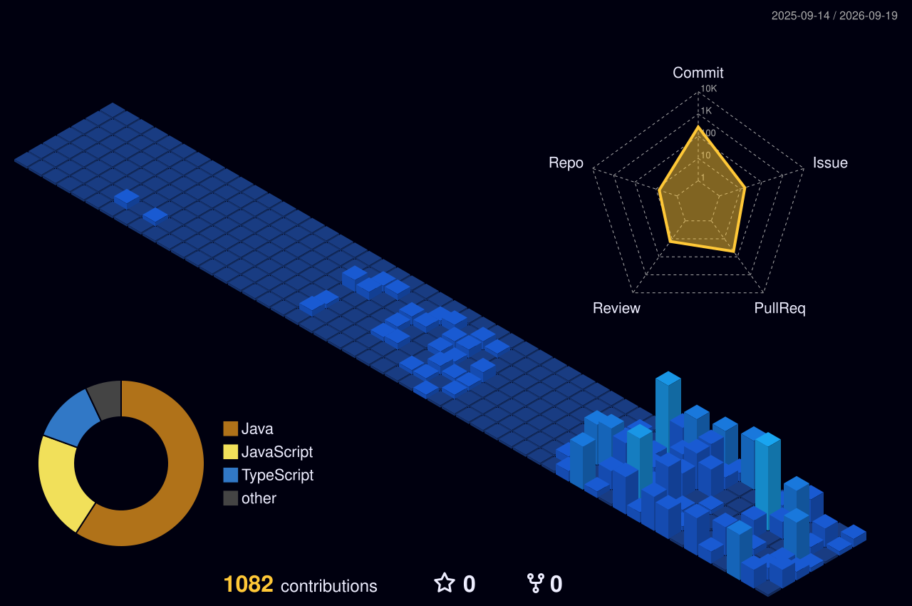

<h1 align="center">Hi 👋, I'm LamPuhc (PhucFeFa)</h1>
<h3 align="center">A passionate developer from Vietnam 🇻🇳</h3>

  

  

---

### 🚀 About Me
- 🔭 I’m currently working on some awesome projects!
- 🌱 I’m currently learning **React, Advanced JS/TS, UI/UX**
- 👯 I’m looking to collaborate on Open Source projects
- 💬 Ask me about **JavaScript, Web Development**
- 📫 How to reach me: ...
- ⚡ Fun fact: I love building bots and automations!

---

### 🛠️ Languages and Tools

  

---

### 📊 GitHub Stats

  
  

  

---

### 🏆 3D Contribution Graph
*The graph is auto-generated daily by GitHub Actions.*

  <!-- GitHub Profile 3D action sẽ tự động sinh ra thư mục profile-3d-contrib và push lên nhánh chính -->
  

---

### 🐍 Commits Snake Animation
*Watch the snake eat my commits! Auto-generated by GitHub Actions.*

  <picture>
    <source media="(prefers-color-scheme: dark)" srcset="https://raw.githubusercontent.com/PhucFeFa/PhucFeFa/output/dist/github-contribution-grid-snake-dark.svg">
    <source media="(prefers-color-scheme: light)" srcset="https://raw.githubusercontent.com/PhucFeFa/PhucFeFa/output/dist/github-contribution-grid-snake.svg">
    
  </picture>

---

  

